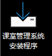
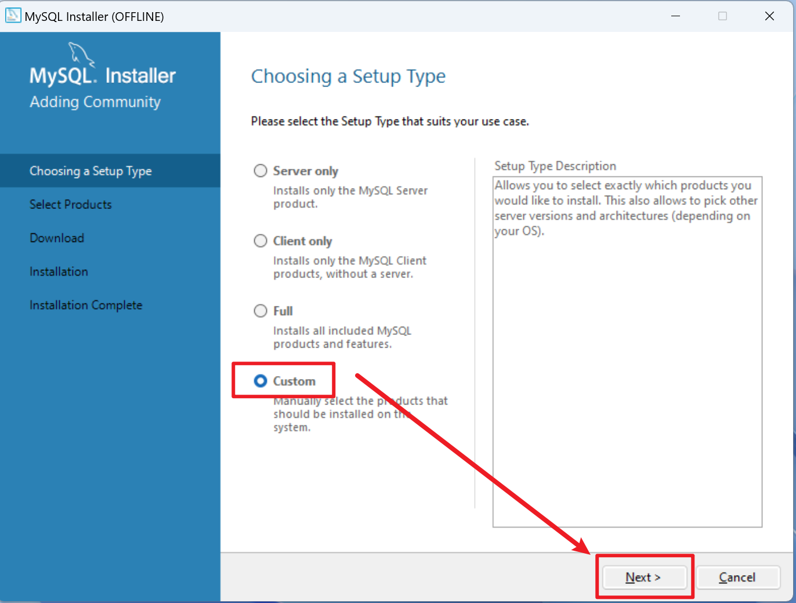
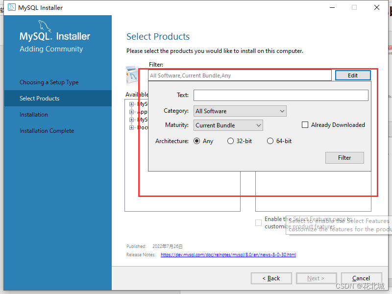
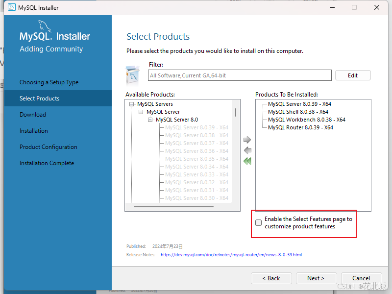
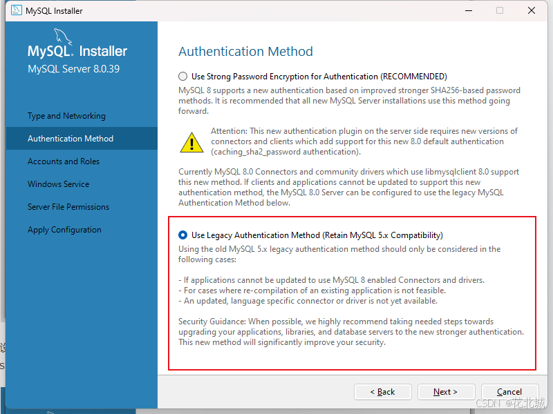

## 安装指引

## 第一步

-   双击 "课室管理系统安装程序.exe"

-   弹出以管理员方式运行 选择"确定"

-   根据指示可以选择安装路径

-   接着等待安装完成

## 第二步

-   进入刚才选择安装的路径打开"课室管理系统"文件夹（可能名称不太一样
    但文件内容和图中一样

-   右键 "install\_mysql\_java\_and\_configure-MSI版本.bat"
    选择以管理员方式运行（不会的话直接双击也行）

-   会弹出 "Java" 的安装程序 同样允许获得管理员权限（选择确定）

-   没有弹出的话就自行点开文件夹里面的 "jdk-21\_windows-x64\_bin.exe" 和
    "mysql-installer-community-8.0.41.0.msi"

## 第三步 ✳安装和配置MySQL

-   接着会弹出 "MySQL" 的安装程序 同样允许获得管理员权限（选择确定）

-   然后等待进入安装程序

-   选择自定义"custom"

-   选择"64-bit" 按下 "Filter"

-   把筛选后的 "Available Products" 逐个展开
    然后点击中间的向右的绿色箭头 把四个程序全部加到右边框里面
    然后勾选下方红框选项 然后点下一步 "Next"

-   接下来点 "Next" 或者
    "Execute"（注意先看再下一张图片
    选择红框选项）

-   重点这里一定要选下方选项 然后"Next"

-   接下来输入两次密码 Ch1234

-   这里可以不管 一直选择 "Next"或者 "Execute" 直到完成安装

-   接着会弹出黑窗口可以直接关掉 然后在弹出的 Workbench 里面双击 "MySQL
    Connections"标题下的 "Local instance MySQL" 输入刚才的密码 Ch1234

-   可以勾选保存密码

-   然后进入页面选择左上角 "File" 中的 "Open SQL Script"

-   进入到最开始安装程序的路径

-   点击图中的第一个闪电⚡图标

## 第四步

-   然后可以回到桌面，双击打开"课室管理系统"

-   出现这样的界面即安装成功

-   闪退的按照以下操作检查 按下 "Windows" 键 输入
    "path"选择编辑系统环境变量

-   接着选环境变量查看是否有 "JAVA\_HOME"，"Path" 里面是否有蓝框路径
    没有可以自行新建添加选择对应路径

  

## 卸载指引

## 第一步 卸载MySQL

-   双击文件夹里面的图中所示文件 然后同样给管理员权限（就是点确定）

-   然后等待出现这个界面 选择右边的 "Remove"

-   然后勾选 "Product" 全选 点 "Next" 或 "Execute" 等待卸载完成关掉即可

## 第二步 卸载JDK21（有两种方法）

### 第一种方法

-   直接进入到 如图所示路径 按下"Shift+Delete" 加回车
    然后提示要管理员全选 直接选是

-   提示删不掉的先把 "课室管理系统" 程序关掉 或者进行如下操作

-   然后按下 "Windows" 键 输入"path" 进入到环境变量 选择环境变量

-   选择 "JAVA\_HOME" 再选 "删除"

-   接着再选择"path"里面的蓝框所示路径 右边选项选择 "删除"

  

### 第二种方法

-   按下 "windows+i" 打开设置 或者按下 "windows" 选择左边齿轮

-   找到应用 搜索 "Java"

-   点击卸载

-   同样删不掉的先把 "课室管理系统" 程序关掉 或者进行如下操作

-   然后按下 "Windows" 键 输入"path" 进入到环境变量 选择环境变量

-   选择 "JAVA\_HOME" 再选 "删除"

-   接着再选择"path"里面的蓝框所示路径 右边选项选择 "删除"

## 第三步 删除文件夹

-   进入到安装路径下的文件夹 双击运行 "unins000.exe"
    在弹出的窗口选择确定

-   删不完全的先完成上面的步骤 或者重启后再删除剩余部分 或者按下 "win+x"
    进入任务管理器找到相关进程并结束后重试删除

